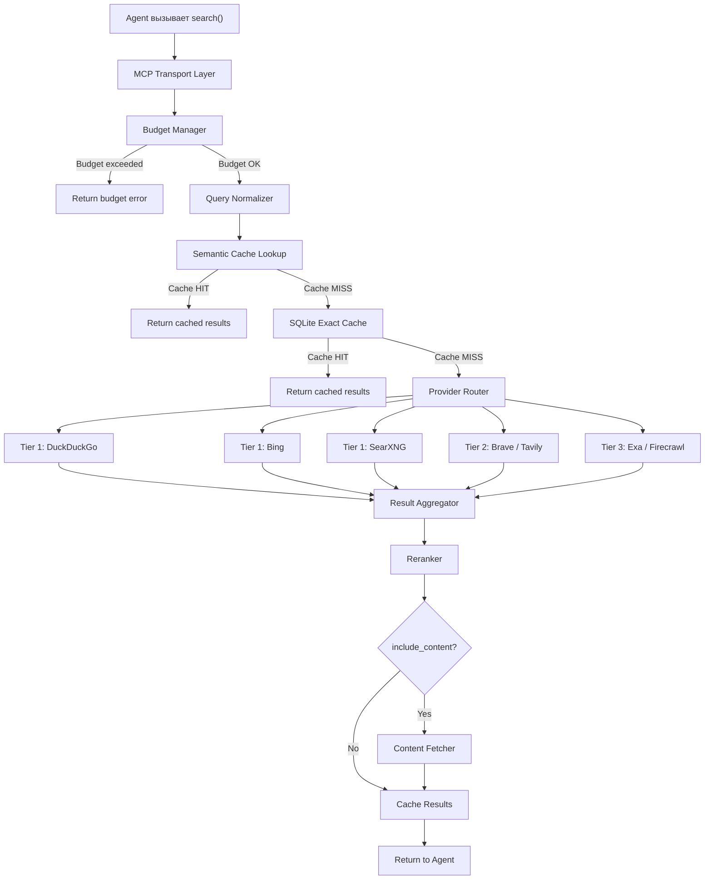
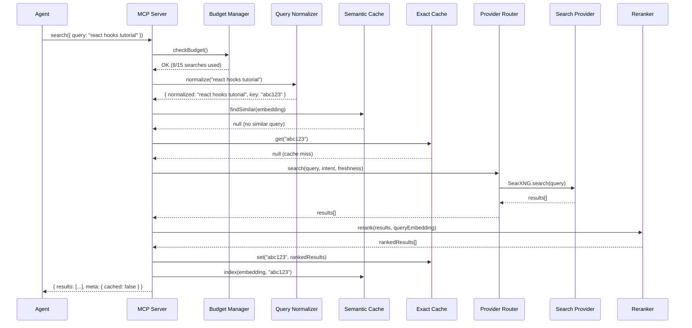
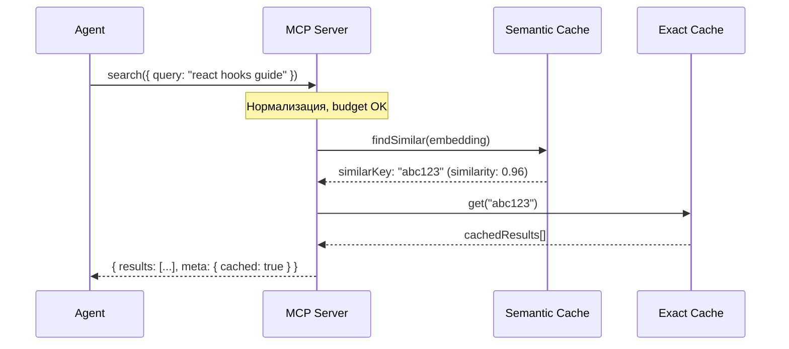

# Архитектура Search MCP Server

## Обзор Pipeline

Каждый вызов `search()` проходит через линейный pipeline:



## Слои системы

### 1. MCP Transport Layer (`src/index.ts`)

Точка входа. Регистрирует 4 инструмента через `@modelcontextprotocol/sdk`: `search`, `github_search`, `gitlab_search`, `status`. Обрабатывает JSON-RPC через stdio.

**Ответственность:**
- Регистрация инструментов
- Валидация входных параметров (zod)
- Сериализация ответов
- Обработка ошибок верхнего уровня

### 2. Budget Manager (`src/limits/budget-manager.ts`)

Первая проверка. Если лимит задачи исчерпан — мгновенный отказ без обращения к провайдерам.

**Ответственность:**
- Подсчёт запросов в текущем окне
- Подсчёт page fetch в текущем окне
- Дедупликация семантически похожих запросов
- Отказ при превышении бюджета

### 3. Query Normalizer (`src/search/query-normalizer.ts`)

Нормализует запрос агента для лучшего попадания в кэш и более качественной выдачи.

**Ответственность:**
- Приведение к lowercase
- Удаление лишних пробелов и спецсимволов
- Расширение аббревиатур (опционально)
- Генерация стабильного cache key

### 4. Semantic Cache (`src/cache/semantic-cache.ts`)

Ищет семантически похожий запрос, для которого уже есть результаты.

**Ответственность:**
- Вычисление embedding запроса
- Поиск ближайших соседей в sqlite-vec
- Порог similarity (configurable, default 0.92)
- Возврат результатов похожего запроса

### 5. SQLite Exact Cache (`src/cache/sqlite.ts`)

Точный кэш по нормализованному cache key.

**Ответственность:**
- Хранение queries, results, pages
- TTL-based eviction
- Статистика для status()

### 6. Provider Router (`src/search/provider-router.ts`)

Выбирает провайдера и управляет fallback.

**Ответственность:**
- Выбор провайдера на основе health
- Параллельный запрос 2 healthy провайдеров
- Health tracking провайдеров
- Rate limit enforcement

### 7. Search Providers (`src/search/providers/`)

Адаптеры для конкретных поисковых систем. Все реализуют единый интерфейс `SearchProvider`.

### 8. Reranker (`src/search/reranker.ts`)

Финальное ранжирование агрегированных результатов.

**Ответственность:**
- Semantic similarity scoring
- Domain quality scoring
- Freshness scoring
- Position blending

### 9. Content Fetcher (`src/fetch/`)

Опциональный слой. Скачивает и очищает страницы.

**Ответственность:**
- HTTP GET с retry и timeout
- HTML → Markdown (readability + turndown)
- Усечение по max length
- Кэширование в SQLite

## Потоки данных

### Обычный поиск (cache miss)



### Семантический cache hit



## Модель данных

### Основные типы

```typescript
interface SearchRequest {
  query: string;
  intent: "web" | "docs" | "github" | "news";
  freshness: "any" | "day" | "week" | "month";
  max_results: number;
  include_content: boolean;
}

interface SearchResult {
  title: string;
  url: string;
  snippet: string;
  content?: string;
  source: string;
  published_date?: string;
  relevance_score: number;
}

interface SearchResponse {
  results: SearchResult[];
  meta: SearchMeta;
}

interface SearchMeta {
  total_results: number;
  cached: boolean;
  query_normalized: string;
  search_time_ms: number;
}
```

### Интерфейс провайдера

```typescript
interface SearchProvider {
  name: string;
  tier: 1 | 2 | 3;

  search(query: string, options: ProviderOptions): Promise<ProviderResult[]>;
  healthCheck(): Promise<boolean>;

  getStats(): ProviderStats;
}

interface ProviderOptions {
  intent: string;
  freshness: string;
  max_results: number;
}

interface ProviderResult {
  title: string;
  url: string;
  snippet: string;
  published_date?: string;
  raw_position: number;
  provider: string;
}

interface ProviderStats {
  requests_today: number;
  limit_today: number | null;
  avg_latency_ms: number;
  last_error?: string;
  healthy: boolean;
}
```

## Принципы

1. **Agent Ignorance** — агент не знает внутреннюю механику
2. **Graceful Degradation** — если Tier 1 упал, fallback на Tier 2/3
3. **Cache First** — семантический → точный → провайдер
4. **Budget Safety** — жёсткие лимиты на запросы и fetch
5. **Local First** — предпочтение SearXNG и локальным embeddings
