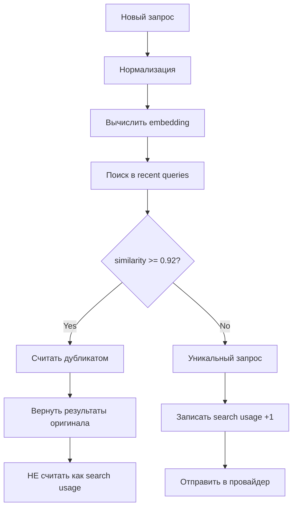
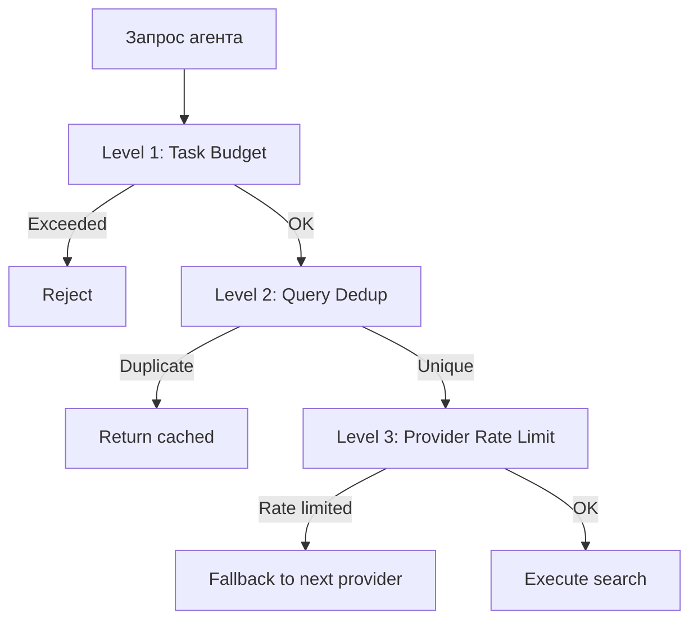

# Защита от "сумасшедшего агента"

## Проблема

AI-агент может войти в цикл поиска:
- Искать одно и то же разными формулировками
- Загружать десятки страниц, не используя результаты
- Исчерпать API-лимиты провайдеров за одну задачу
- Замедлить работу из-за бесконечных fetch-запросов

## Budget Manager (`src/limits/budget-manager.ts`)

### Лимиты на задачу

| Ресурс | Лимит | Описание |
|--------|-------|----------|
| Поисковые запросы | 10–15 | Уникальных запросов к провайдерам |
| Page fetch | 20–30 | Загрузок страниц |
| Окно бюджета | 30 минут | Sliding window |

**Конфигурация:**
```env
BUDGET_MAX_SEARCHES=15
BUDGET_MAX_FETCHES=30
BUDGET_WINDOW_MINUTES=30
```

### Механика

```typescript
interface TaskBudget {
  window_start: number;      // Начало окна (Unix timestamp)
  window_minutes: number;    // Размер окна
  max_searches: number;      // Лимит поисковых запросов
  max_fetches: number;       // Лимит загрузок страниц
  searches_used: number;     // Использовано поисков
  fetches_used: number;      // Использовано загрузок
}

class BudgetManager {
  checkBudget(type: "search" | "fetch"): BudgetCheckResult;
  recordUsage(type: "search" | "fetch"): void;
  getRemaining(): { searches: number; fetches: number };
  reset(): void;
}

interface BudgetCheckResult {
  allowed: boolean;
  remaining: number;
  message?: string;         // Сообщение об ошибке для агента
}
```

### Ответ при превышении бюджета

```json
{
  "error": "BUDGET_EXCEEDED",
  "message": "Search budget exhausted: 15/15 searches used in current 30-minute window. Budget resets at 14:35 UTC. Try rephrasing your approach or waiting.",
  "budget": {
    "searches_used": 15,
    "searches_max": 15,
    "fetches_used": 22,
    "fetches_max": 30,
    "resets_at": "2024-01-15T14:35:00Z"
  }
}
```

---

## Query Deduplication

### Проблема

Агент часто ищет одно и то же разными словами:

```
"opencode plugins"
"opencode plugin docs"
"opencode plugin documentation"
"how to create opencode plugin"
```

Без дедупликации — 4 запроса к провайдерам. С дедупликацией — 1.

### Алгоритм



### Буфер последних запросов

```typescript
interface RecentQuery {
  query: string;
  embedding: number[];
  timestamp: number;
  cache_key: string;
}

class DeduplicationBuffer {
  private buffer: RecentQuery[] = [];
  private maxSize = 50;        // Последние 50 запросов
  private ttl = 30 * 60 * 1000; // 30 минут

  isDuplicate(embedding: number[]): RecentQuery | null {
    // Очистить expired
    this.evictExpired();

    for (const recent of this.buffer) {
      if (cosineSimilarity(embedding, recent.embedding) >= 0.92) {
        return recent;
      }
    }
    return null;
  }

  add(query: RecentQuery): void {
    this.buffer.push(query);
    if (this.buffer.length > this.maxSize) {
      this.buffer.shift();
    }
  }
}
```

### Пример

```
[14:00:01] search("opencode plugins")
  → Budget: 1/15 searches
  → Providers: SearXNG → 10 results
  → Cached under key "abc123"

[14:00:15] search("opencode plugin docs")
  → Embedding similarity with "opencode plugins": 0.94
  → DEDUPLICATED → return cached results for "abc123"
  → Budget: still 1/15 (not counted)

[14:00:30] search("opencode plugin documentation")
  → Embedding similarity with "opencode plugins": 0.93
  → DEDUPLICATED → return cached results for "abc123"
  → Budget: still 1/15 (not counted)

[14:01:00] search("vscode extensions api")
  → Embedding similarity with all recent: max 0.45
  → UNIQUE → send to providers
  → Budget: 2/15 searches
```

---

## Rate Limiting провайдеров

Помимо task budget, каждый провайдер имеет свои rate limits:

```typescript
interface ProviderRateLimit {
  requests_per_minute: number;    // Запросов в минуту
  requests_per_day: number;       // Запросов в день
  requests_per_month: number;     // Запросов в месяц
  current_minute: number;
  current_day: number;
  current_month: number;
}

// Дефолты
const RATE_LIMITS = {
  searxng:     { rpm: 30, rpd: Infinity, rpm_month: Infinity },
  duckduckgo:  { rpm: 10, rpd: 200, rpm_month: Infinity },
  brave:       { rpm: 15, rpd: 60, rpm_month: 2000 },
  tavily:      { rpm: 10, rpd: 30, rpm_month: 1000 },
  exa:         { rpm: 10, rpd: 30, rpm_month: 1000 },
  firecrawl:   { rpm: 5,  rpd: 15, rpm_month: 500 },
};
```

## Итого: три уровня защиты


