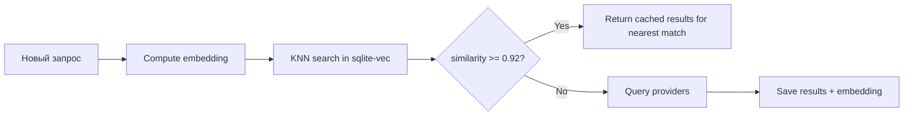

# Кэширование

## Обзор

Двухуровневая система кэширования: семантический слой поверх SQLite.

```
Запрос агента
    ↓
[Семантический кэш] ← embedding similarity
    ↓ (miss)
[SQLite exact кэш]  ← normalized query key
    ↓ (miss)
Провайдеры
    ↓
Результаты → сохранить в оба кэша
```

## SQLite Exact Cache

### Схема базы данных

```sql
-- Кэшированные запросы
CREATE TABLE queries (
    id            INTEGER PRIMARY KEY AUTOINCREMENT,
    cache_key     TEXT NOT NULL UNIQUE,       -- Нормализованный ключ
    query_raw     TEXT NOT NULL,              -- Оригинальный запрос
    query_norm    TEXT NOT NULL,              -- Нормализованный запрос
    intent        TEXT NOT NULL DEFAULT 'web',
    freshness     TEXT NOT NULL DEFAULT 'any',
    created_at    INTEGER NOT NULL,           -- Unix timestamp
    expires_at    INTEGER NOT NULL,           -- Unix timestamp (TTL)
    hit_count     INTEGER NOT NULL DEFAULT 0, -- Количество попаданий
    last_hit_at   INTEGER                     -- Последнее попадание
);

CREATE INDEX idx_queries_cache_key ON queries(cache_key);
CREATE INDEX idx_queries_expires ON queries(expires_at);

-- Кэшированные результаты поиска
CREATE TABLE results (
    id            INTEGER PRIMARY KEY AUTOINCREMENT,
    query_id      INTEGER NOT NULL REFERENCES queries(id) ON DELETE CASCADE,
    title         TEXT NOT NULL,
    url           TEXT NOT NULL,
    snippet       TEXT NOT NULL,
    source_domain TEXT NOT NULL,
    published_date TEXT,
    relevance_score REAL NOT NULL DEFAULT 0.0,
    position      INTEGER NOT NULL,          -- Позиция в выдаче
    provider      TEXT NOT NULL,             -- Какой провайдер вернул
    created_at    INTEGER NOT NULL
);

CREATE INDEX idx_results_query_id ON results(query_id);
CREATE INDEX idx_results_url ON results(url);

-- Кэшированные страницы (fetch layer)
CREATE TABLE pages (
    id            INTEGER PRIMARY KEY AUTOINCREMENT,
    url           TEXT NOT NULL UNIQUE,
    url_hash      TEXT NOT NULL,              -- SHA-256 для быстрого lookup
    title         TEXT,
    content_md    TEXT NOT NULL,              -- Очищенный Markdown
    content_length INTEGER NOT NULL,
    fetched_at    INTEGER NOT NULL,
    expires_at    INTEGER NOT NULL,
    fetch_time_ms INTEGER NOT NULL,
    status_code   INTEGER NOT NULL
);

CREATE INDEX idx_pages_url_hash ON pages(url_hash);
CREATE INDEX idx_pages_expires ON pages(expires_at);

-- Статистика провайдеров
CREATE TABLE provider_stats (
    id            INTEGER PRIMARY KEY AUTOINCREMENT,
    provider      TEXT NOT NULL,
    date          TEXT NOT NULL,              -- YYYY-MM-DD
    requests      INTEGER NOT NULL DEFAULT 0,
    errors        INTEGER NOT NULL DEFAULT 0,
    avg_latency_ms REAL NOT NULL DEFAULT 0,
    UNIQUE(provider, date)
);
```

### TTL стратегия

| Тип данных | TTL (мин) | TTL (макс) | Логика |
|-----------|-----------|-----------|--------|
| Web search | 6 часов | 24 часа | Стандартный поиск |
| Docs search | 1 час | 6 часов | Документация обновляется реже |
| News search | 15 минут | 60 минут | Новости быстро устаревают |
| GitHub search | 2 часа | 12 часов | Issues/PR обновляются часто |
| Fetched pages | 1 день | 7 дней | Контент страниц стабилен |

**Формула TTL:**
```typescript
function calculateTTL(intent: string, freshness: string): number {
  const baseTTL = {
    web:    6 * 3600,     // 6 часов
    docs:   3 * 3600,     // 3 часа
    news:   30 * 60,      // 30 минут
    github: 4 * 3600,     // 4 часа
  };

  const freshnessMultiplier = {
    any:   1.0,
    month: 0.8,
    week:  0.5,
    day:   0.2,
  };

  return Math.floor(baseTTL[intent] * freshnessMultiplier[freshness]);
}
```

### Eviction (очистка)

- **Периодическая:** Каждые 30 минут удаляются записи с `expires_at < NOW()`
- **По размеру:** Если БД > 500MB, удаляются старейшие записи с наименьшим `hit_count`
- **Ручная:** `PRAGMA wal_checkpoint(TRUNCATE)` после eviction

---

## Семантический кэш

### Назначение

**Не RAG.** Семантический слой решает узкие задачи:

1. **Поиск похожих запросов** — "react hooks tutorial" ≈ "react hooks guide"
2. **Дедупликация** — избежать повторных запросов к провайдерам
3. **Повторное использование** — вернуть результаты похожего запроса
4. **Реранкинг** — similarity между запросом и snippet для скоринга

### Embedding модели

| Модель | Размерность | Размер | Мультиязычность | Скорость |
|--------|------------|--------|-----------------|----------|
| `multilingual-e5-small` | 384 | ~118MB | ✅ Да | Быстрая |
| `bge-m3` | 1024 | ~570MB | ✅ Да | Средняя |

**Рекомендация:** `multilingual-e5-small` для MVP (меньше, быстрее, достаточная точность).

### Хранилище embeddings

```sql
-- Расширение sqlite-vec
-- Виртуальная таблица для vector search
CREATE VIRTUAL TABLE query_embeddings USING vec0(
    query_id INTEGER PRIMARY KEY,
    embedding FLOAT[384]    -- Размерность зависит от модели
);
```

**Операции:**
```sql
-- Вставка embedding
INSERT INTO query_embeddings (query_id, embedding) VALUES (?, ?);

-- Поиск ближайших соседей
SELECT
    query_id,
    distance
FROM query_embeddings
WHERE embedding MATCH ?     -- query embedding
ORDER BY distance
LIMIT 5;
```

### Порог similarity

```typescript
const SEMANTIC_CACHE_THRESHOLD = 0.92;  // cosine similarity

// Если similarity >= 0.92, считаем это cache hit
// и возвращаем результаты похожего запроса
```

**Почему 0.92:**
- 0.95+ слишком строго — только почти идентичные запросы
- 0.85 слишком мягко — разные запросы будут объединяться
- 0.92 — хороший баланс: ловит перефразировки, но не смешивает темы

### Пример работы

```
Запрос 1: "opencode plugins"          → embedding A → провайдер → результаты R
Запрос 2: "opencode plugin docs"      → embedding B → similarity(A, B) = 0.94 → cache HIT → R
Запрос 3: "opencode plugin documentation" → embedding C → similarity(A, C) = 0.93 → cache HIT → R
Запрос 4: "vscode extensions"         → embedding D → similarity(A, D) = 0.61 → cache MISS → провайдер
```

### Lifecycle


