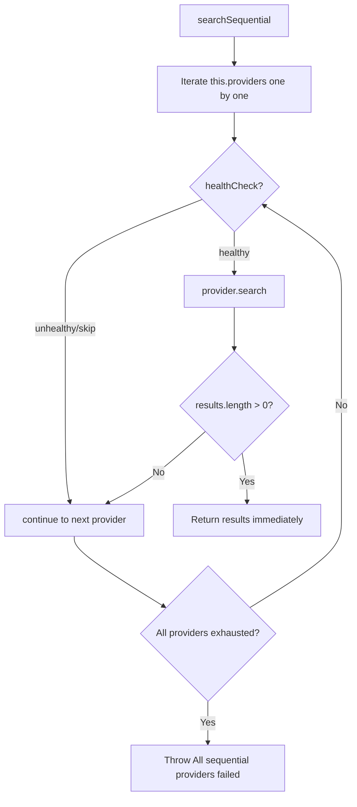

# Provider Fallback Flow

## searchParallel (per-slot fallback)

```mermaid
flowchart TD
    A[searchParallel] --> B[Init allResults=[], lastError=[], queue=[...providers]]
    B --> C[Start maxParallel slots via Promise.allSettled]

    C --> D[trySlot]
    D --> E{queue not empty?}
    E -- No --> F[Slot done - return]
    E -- Yes --> G[queue.shift -> provider]
    G --> H{healthCheck?}
    H -- unhealthy --> I[log warn, continue loop]
    I --> E
    H -- healthy --> J[provider.search]
    J --> K{results > 0?}
    K -- Yes --> L[allResults.push, slot done - return]
    K -- No --> M[log warn empty, continue loop]
    M --> E
    J --> N[catch error -> lastError.push, continue loop]
    N --> E

    C --> O[All slots settled]
    O --> P{allResults.length > 0?}
    P -- Yes --> Q[Return allResults]
    P -- No --> R{lastError.length > 0?}
    R -- Yes --> S[Throw All providers failed]
    R -- No --> T[Throw No providers configured]
```

## searchSequential (unchanged, for comparison)


