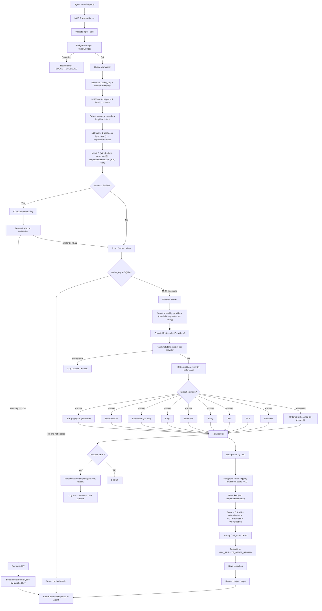
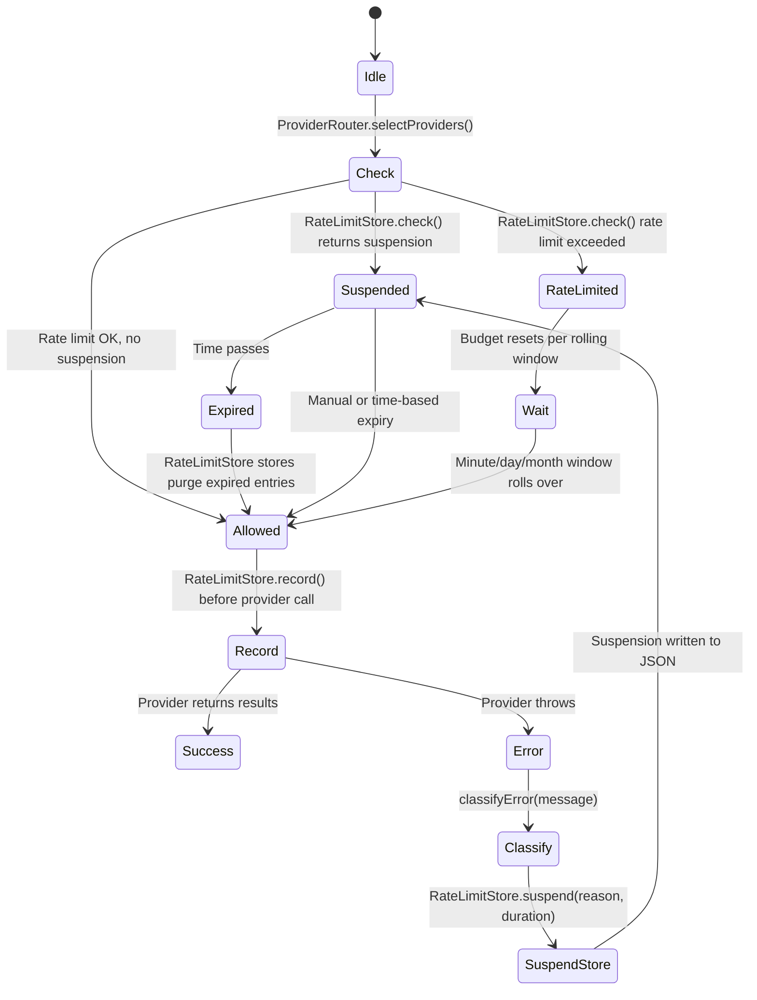
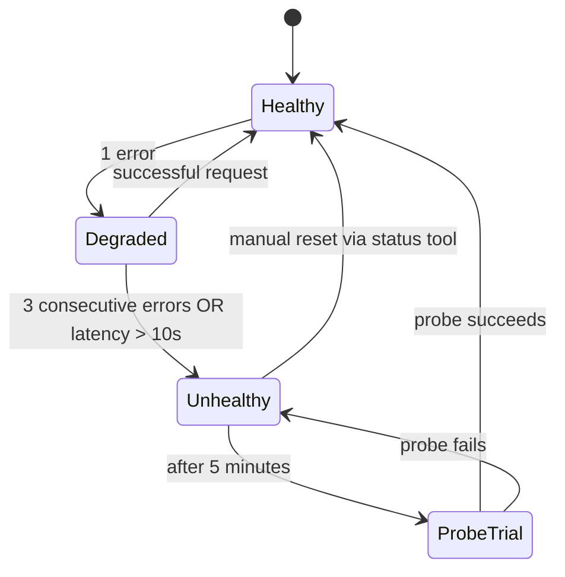
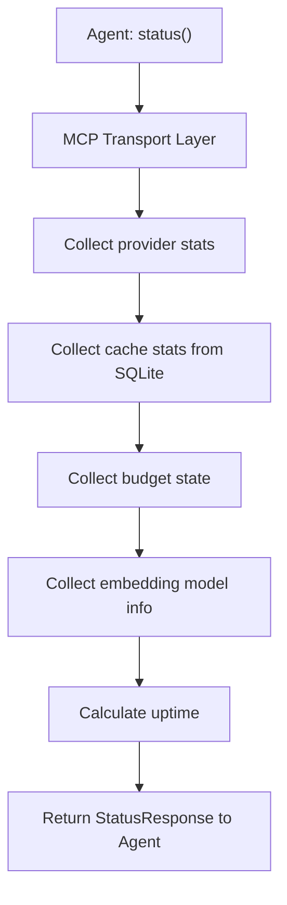

# Search Pipeline Flow

## Main Search Flow



## Rate Limit and Suspension Flow



## Brave Web HTML Parsing

```mermaid
flowchart TD
    A["fetch(search.brave.com)"] --> B[Raw HTML]
    B --> C["snip loop: /<div.*snippet.*data-pos="(\d+)"/>gi"]
    C --> D[Depth counter: match opening/closing div tags]
    D --> E[Extract snippet block from <div> to matching </div>]
    E --> F[Extract URL: href="https?..." from block]
    E --> G[Extract title: class="...title..." > content </]
    E --> H[Extract snippet: class="...content..." > content </div>]
    H --> I[Strip HTML tags, normalize whitespace]
    E --> J[Extract date: span class="t-secondary" > text - </]
    J --> K{new Date(text) valid?}
    K -->|Yes| L[Set published_date]
    K -->|No| M[Skip date]
    G & F & I & L & M --> N[Deduplicate by URL (seen Set)]
    N --> O[Return results slice(max_results)]
```

## Startpage Search Flow

```mermaid
sequenceDiagram
    participant Agent as Provider
    participant SP as startpage.com
    participant Home as Homepage /

    Agent->>Home: GET / (sc code fetch, 1h cache)
    Home-->>Agent: HTML with <input name="sc" value="...">
    Note over Agent: build N1N-delimited preferences cookie
    Agent->>SP: POST /sp/search (query, sc, cat=web, language)
    SP-->>Agent: HTML with React.createElement(UIStartpage.AppSerpWeb, {...})
    Note over Agent: depth-track JSON extraction<br/>parse render.presenter.regions.mainline[].results[]
    Agent->>Agent: filter web-google / news-bing sections
    Agent->>Agent: extract title, url, snippet, published_date
```



## Provider Health Recovery



## Status Flow




