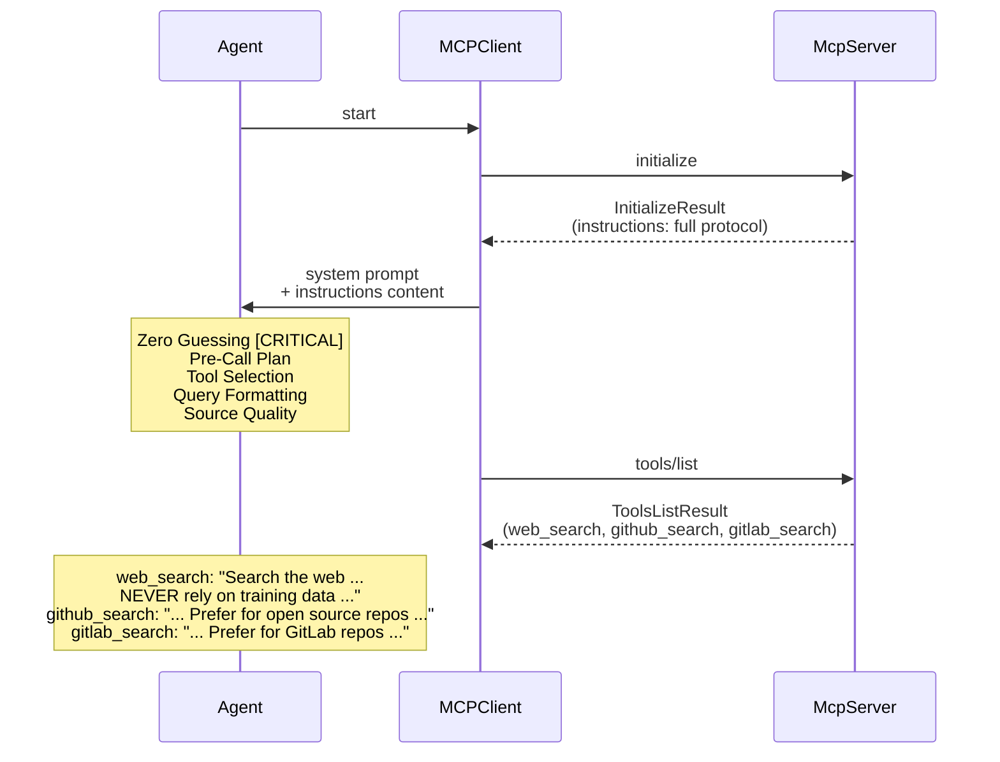
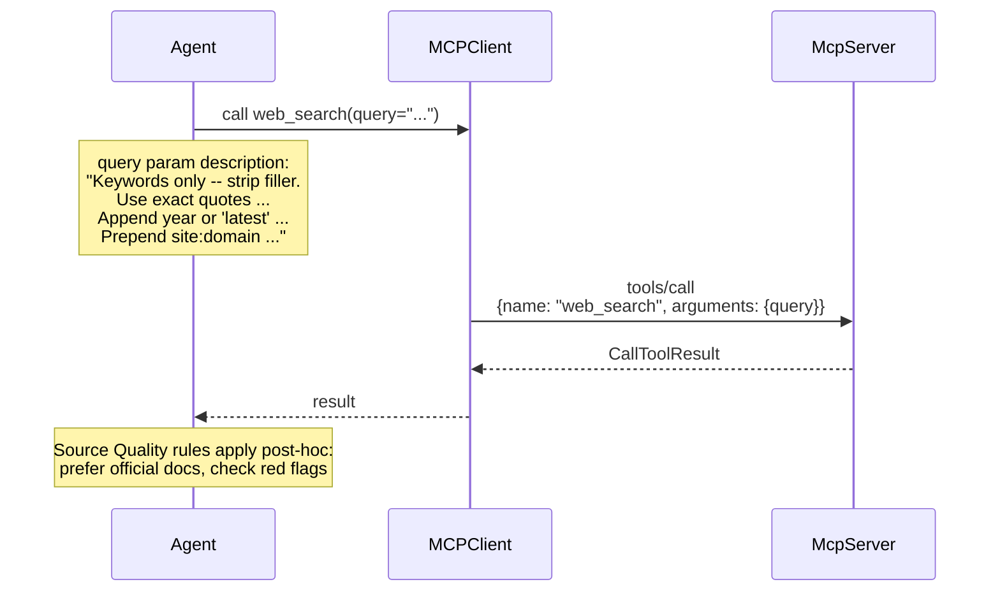

# Search Protocol Injection Flow

How search protocol content reaches the agent through MCP channels only (no file references).

## Connection-time injection (InitializeResult)



## Call-time parameter injection (ToolsCall)



## Injection channels summary

```
InitializeResult.instructions (server-level, always in context)
  ├── Zero Guessing [CRITICAL]
  ├── Pre-Call Plan
  ├── Tool Selection routing
  ├── Query Formatting (summary)
  └── Source Quality

Tool.description (per-tool, at selection time)
  ├── web_search + Zero Guessing reinforcement
  ├── github_search + selection guidance
  └── gitlab_search + selection guidance

Parameter.describe() (per-parameter, at invocation time)
  └── web_search.query → formatting rules
```
