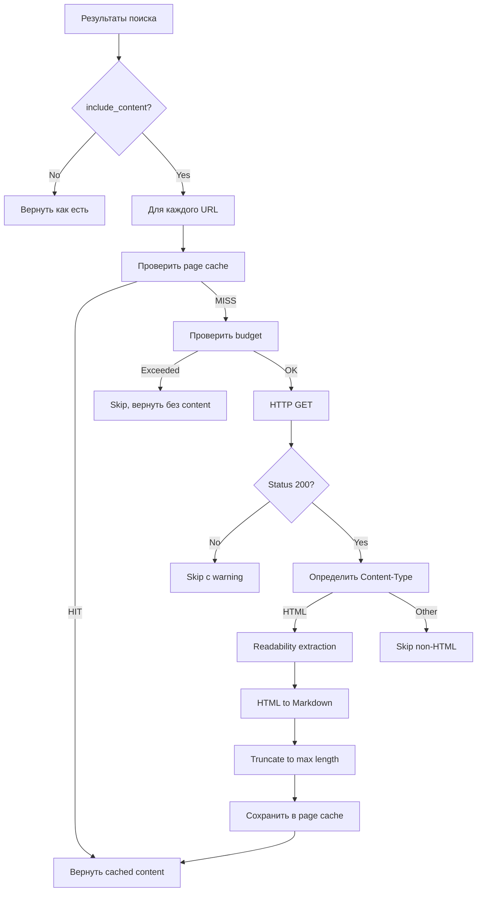

# Fetch Layer

## Обзор

Fetch Layer отвечает за загрузку, очистку и преобразование веб-страниц в Markdown. Активируется когда `include_content: true` в запросе.



## Fetcher (`src/fetch/fetcher.ts`)

### Ответственность

- HTTP GET запросы с configurable timeout
- Retry с exponential backoff
- Respectful crawling (User-Agent, delay)
- Проверка Content-Type
- Ограничение размера ответа

### Конфигурация

```typescript
interface FetcherConfig {
  timeout_ms: number;        // Default: 10000 (10 сек)
  max_retries: number;       // Default: 2
  retry_delay_ms: number;    // Default: 1000
  max_body_size: number;     // Default: 5MB
  user_agent: string;        // Default: "SearchMCP/1.0 (bot)"
  concurrent_limit: number;  // Default: 3 параллельных fetch
  delay_between_ms: number;  // Default: 500 между запросами к одному домену
}
```

### Заголовки запроса

```typescript
const DEFAULT_HEADERS = {
  "User-Agent": "SearchMCP/1.0 (+https://github.com/search-mcp; bot)",
  "Accept": "text/html,application/xhtml+xml",
  "Accept-Language": "en-US,en;q=0.9,ru;q=0.8",
  "Accept-Encoding": "gzip, deflate",
};
```

### Retry стратегия

```typescript
// Exponential backoff
const delays = [1000, 2000, 4000]; // ms

// Retry только на:
const RETRYABLE_STATUS = [429, 500, 502, 503, 504];
const RETRYABLE_ERRORS = ["ECONNRESET", "ETIMEDOUT", "ENOTFOUND"];

// Не retry на:
// 400, 401, 403, 404 — клиентские ошибки, retry бесполезен
```

---

## Readability (`src/fetch/readability.ts`)

### Pipeline очистки

```
Raw HTML
  ↓
[mozilla/readability] — извлечение основного контента
  ↓
Cleaned HTML (без nav, sidebar, ads, footer)
  ↓
[turndown] — HTML → Markdown
  ↓
Post-processing
  ↓
Clean Markdown
```

### Зависимости

| Пакет | Назначение |
|-------|-----------|
| `@mozilla/readability` | Извлечение основного контента из HTML |
| `linkedom` или `jsdom` | DOM-парсинг для readability |
| `turndown` | Конвертация HTML → Markdown |
| `turndown-plugin-gfm` | Поддержка GFM таблиц, strikethrough |

### Post-processing

После конвертации в Markdown:

```typescript
function postProcess(markdown: string): string {
  return markdown
    // Удалить множественные пустые строки
    .replace(/\n{3,}/g, "\n\n")
    // Удалить пустые заголовки
    .replace(/^#{1,6}\s*$/gm, "")
    // Удалить inline-стили
    .replace(/\{[^}]*style[^}]*\}/g, "")
    // Нормализовать пробелы
    .replace(/[ \t]+$/gm, "")
    // Trim
    .trim();
}
```

### Усечение контента

```typescript
const MAX_CONTENT_LENGTH = 8000;  // символов

function truncateContent(content: string, maxLength: number): string {
  if (content.length <= maxLength) return content;
  
  // Обрезаем по последнему полному параграфу
  const truncated = content.substring(0, maxLength);
  const lastParagraph = truncated.lastIndexOf("\n\n");
  
  if (lastParagraph > maxLength * 0.5) {
    return truncated.substring(0, lastParagraph) + "\n\n[... truncated]";
  }
  
  return truncated + "\n\n[... truncated]";
}
```

---

## Кэширование страниц

Загруженные страницы кэшируются в таблице `pages` (см. [caching.md](caching.md)).

**TTL страниц:** 1–7 дней (зависит от домена).

```typescript
const PAGE_TTL: Record<string, number> = {
  // Документация — длинный TTL (редко меняется)
  "docs":        7 * 24 * 3600,    // 7 дней
  "readthedocs": 7 * 24 * 3600,
  "developer":   5 * 24 * 3600,    // 5 дней

  // GitHub — средний TTL
  "github.com":  2 * 24 * 3600,    // 2 дня

  // Q&A — средний TTL
  "stackoverflow": 3 * 24 * 3600,  // 3 дня

  // Новости, блоги — короткий TTL
  "medium.com":  1 * 24 * 3600,    // 1 день
  "dev.to":      1 * 24 * 3600,
  
  // Default
  "default":     2 * 24 * 3600,    // 2 дня
};
```

## Ограничения

- Не загружаем PDF, изображения, видео
- Не выполняем JavaScript (SPA не поддерживаются)
- Максимум 3 параллельных загрузки
- Respectful delay между запросами к одному домену
- Не загружаем страницы, заблокированные `robots.txt` (опционально, V2+)
