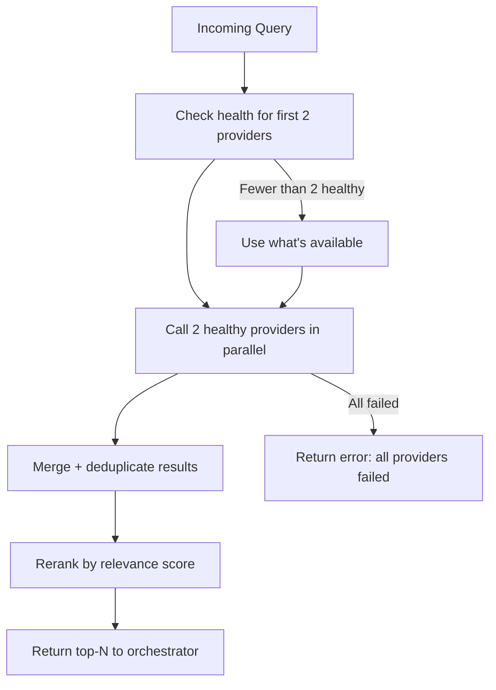

# Поисковые провайдеры

## Обзор

Провайдеры работают с маршрутизатором, который выбирает первые 2 healthy-провайдера и зовёт их параллельно. Результаты агрегируются, дедуплицируются и реранжируются. При недоступности — fallback на следующие.

## Tier 1 — Основные (бесплатные, scraping)

### DuckDuckGo

| Параметр | Значение |
|----------|----------|
| Тип | HTML scraping |
| API | POST `html.duckduckgo.com/html/` |
| Лимиты | 10 req/min (IP-based) |
| Ключ | Не нужен |
| Intents | web, docs |

**Особенности:**
- Бесплатный без регистрации
- 10 результатов на страницу, до 2 страниц = 20 сырых результатов
- Rate limit с задержкой между запросами

**Конфигурация:**
```env
DDG_ENABLED=true
DDG_DELAY_MS=1000
DDG_MAX_PER_MINUTE=10
```

---

### Bing

| Параметр | Значение |
|----------|----------|
| Тип | HTML scraping |
| API | GET `bing.com/search` |
| Лимиты | Неявные (IP-based) |
| Ключ | Не нужен |
| Intents | web |

**Особенности:**
- Бесплатный без регистрации
- Парсинг `b_algo` блоков из HTML выдачи
- Другой индекс, чем DDG — расширяет покрытие

**Конфигурация:**
```env
BING_ENABLED=true
```

---

### SearXNG

| Параметр | Значение |
|----------|----------|
| Тип | Self-hosted метапоисковик |
| API | REST JSON API |
| Лимиты | Без ограничений (свой сервер) |
| Ключ | Не нужен |
| Intents | web, docs, news |

**Особенности:**
- Полный контроль, нет rate limits
- Агрегирует Google, Bing, DuckDuckGo и др.
- Требует развёрнутый инстанс

**Конфигурация:**
```env
SEARXNG_ENABLED=true
SEARXNG_URL=http://localhost:8888
SEARXNG_ENGINES=google,bing,duckduckgo,stackoverflow
```

---

## Tier 2 — Официальные API (бесплатные лимиты)

### Brave Search API

| Параметр | Значение |
|----------|----------|
| Тип | Официальный REST API |
| Лимиты | 2000 запросов/мес (бесплатно) |
| Ключ | Требуется (бесплатная регистрация) |
| Intents | web, docs, news |

**Конфигурация:**
```env
BRAVE_API_KEY=BSA...
BRAVE_DAILY_LIMIT=60
```

---

### Tavily API

| Параметр | Значение |
|----------|----------|
| Тип | AI-ориентированный поиск |
| Лимиты | 1000 запросов/мес (бесплатно) |
| Ключ | Требуется (бесплатная регистрация) |
| Intents | web, docs |

**Особенности:**
- Создан специально для AI-агентов
- Возвращает `content` (извлечённый текст) из коробки
- Хорошо работает для docs intent

**Конфигурация:**
```env
TAVILY_API_KEY=tvly-...
TAVILY_DAILY_LIMIT=30
```

---

## Tier 3 — Опциональные

### Exa

| Параметр | Значение |
|----------|----------|
| Тип | Семантический поиск |
| Лимиты | 1000 запросов/мес (бесплатно) |
| Ключ | Требуется |
| Intents | web, docs |

```env
EXA_API_KEY=...
```

### Firecrawl

| Параметр | Значение |
|----------|----------|
| Тип | Web scraping + search |
| Лимиты | 500 credits/мес (бесплатно) |
| Ключ | Требуется |
| API | `api.firecrawl.dev/v2/search` |
| Intents | docs |

```env
FIRECRAWL_API_KEY=...
```

---

## Provider Router: алгоритм выбора



## Routing стратегия

**Параллельный запрос 2 провайдеров:**
1. Найти первые 2 healthy провайдера по порядку
2. Вызвать их параллельно через `Promise.allSettled`
3. Агрегировать результаты
4. Реранкер дедуплицирует по нормализованному URL и сортирует

**Порядок провайдеров:** DDG → Bing → SearXNG → Brave → Tavily → Exa → Firecrawl

Если один из двух упал — результаты от второго всё равно возвращаются. Если оба упали — ошибка.

## Health Tracking

Каждый провайдер отслеживает:

```typescript
interface ProviderHealth {
  consecutive_errors: number;
  last_success: Date | null;
  last_error: Date | null;
  avg_latency_ms: number;
  requests_today: number;
  is_healthy: boolean;
}
```

**Провайдер unhealthy если:**
- `consecutive_errors >= 3`

**Восстановление:** unhealthy-провайдер получает пробную попытку при следующем цикле. Если успешна — восстанавливается.