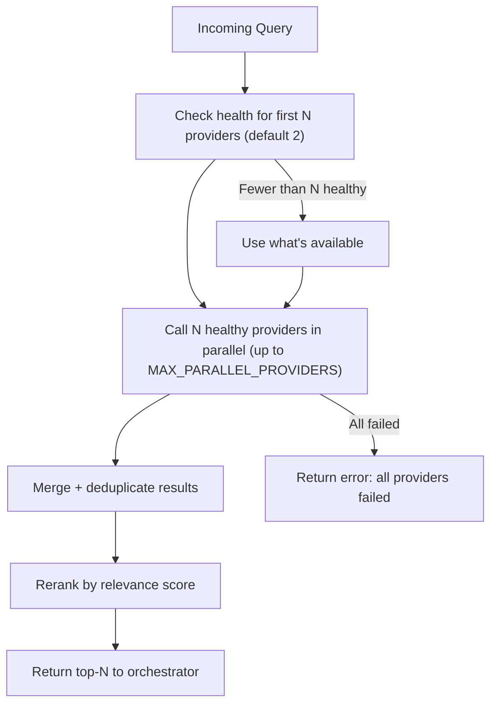

# Search Providers

## Overview

Providers work with the router, which selects the first 2 healthy providers and calls them in parallel. Results are aggregated, deduplicated, and reranked. If a provider is unavailable — fallback to the next ones.

## Tier 1 — Core (free, scraping)

### Startpage (Google Mirror)

| Parameter | Value |
|-----------|-------|
| Type | HTML scraping (Google results via proxy) |
| API | POST `startpage.com/sp/search` |
| Limits | Implicit (IP-based) |
| Key | Not required |
| Intents | web, docs, news |

**Features:**
- Free Google results without API key
- Uses `sc` code + preferences cookie for session
- Extracts date from snippet prefix: `Jan 27, 2026` or `27 Jan 2026`
- 1s delay between requests, incremental backoff on 429

> **⚠️ Undocumented limits.** Startpage does not publish scraping limits. May return captcha or empty results without clear reason.

**Configuration:**
```env
STARTPAGE_ENABLED=true
```

---

### DuckDuckGo

| Parameter | Value |
|-----------|-------|
| Type | HTML scraping |
| API | POST `html.duckduckgo.com/html/` |
| Limits | 10 req/min (IP-based) |
| Key | Not required |
| Intents | web, docs |

**Features:**
- Free, no registration
- 10 results per page, up to 1 page
- 1s delay between requests
- Rate limit with delay between requests

> **⚠️ Undocumented limits.** DDG frequently returns captcha when scraping. No official search API — HTML parsing only.

**Configuration:**
```env
DDG_ENABLED=true
DDG_DELAY_MS=1000
DDG_MAX_PER_MINUTE=10
```

---

### Brave Web

| Parameter | Value |
|-----------|-------|
| Type | HTML scraping |
| API | GET `search.brave.com/search` |
| Limits | Implicit (IP-based, 429 on burst) |
| Key | Not required |
| Intents | web, docs, news |

**Features:**
- Free, no registration
- 1s delay between requests
- 429/403 detection → incremental backoff suspension
- Cookies set: safesearch=off, useLocation=0, summarizer=0, country=us, ui_lang=en-us
- Retry-After header support if Brave starts sending it

> **⚠️ Undocumented limits.** Brave Search is not designed for scraping. Limits are not documented — may return 429 at any time. Brave API (official) is more stable but requires a key.

**Configuration:**
```env
BRAVE_WEB_ENABLED=true
```

---

### Bing

| Parameter | Value |
|-----------|-------|
| Type | HTML scraping |
| API | GET `bing.com/search` |
| Limits | Implicit (IP-based) |
| Key | Not required |
| Intents | web |

**Features:**
- Free, no registration
- Parses `b_algo` blocks from HTML results page
- Different index from DDG — expands coverage
- 1s delay between requests

> **⚠️ Undocumented limits.** Bing does not publish scraping limits. May return captcha under high request frequency. Most stable among scraped providers.

**Configuration:**
```env
BING_ENABLED=true
```

---

## Tier 2 — Official APIs (free tier)

### Brave Search API

| Parameter | Value |
|-----------|-------|
| Type | Official REST API |
| Limits | 2000 requests/month (free) |
| Key | Required (free registration) |
| Intents | web, docs, news |

**Configuration:**
```env
BRAVE_API_KEY=BSA...
BRAVE_DAILY_LIMIT=60
```

---

### Tavily API

| Parameter | Value |
|-----------|-------|
| Type | AI-oriented search |
| Limits | 1000 requests/month (free) |
| Key | Required (free registration) |
| Intents | web, docs |

**Features:**
- Built specifically for AI agents
- Returns `content` (extracted text) out of the box
- Works well for docs intent

**Configuration:**
```env
TAVILY_API_KEY=tvly-...
TAVILY_DAILY_LIMIT=30
```

---

## Tier 3 — Optional

### Exa

| Parameter | Value |
|-----------|-------|
| Type | Semantic search |
| Limits | 1000 requests/month (free) |
| Key | Required |
| Intents | web, docs |

```env
EXA_API_KEY=...
```

### Firecrawl

| Parameter | Value |
|-----------|-------|
| Type | Web scraping + search |
| Limits | 500 credits/month (free) |
| Key | Required |
| API | `api.firecrawl.dev/v2/search` |
| Intents | docs |

```env
FIRECRAWL_API_KEY=...
```

---

## Provider Router: selection algorithm



## Routing Strategy

**Parallel request to 2 providers:**
1. Find the first 2 healthy providers in order
2. Call them in parallel via `Promise.allSettled`
3. Aggregate results
4. Reranker deduplicates by normalized URL and sorts

**Default provider order:** Startpage → DDG → Brave Web → Bing → Brave API → Tavily → Exa → Firecrawl  
Custom order via `PROVIDER_ORDER` in `.env` (comma-separated names).

If one provider fails — results from the other are still returned (parallel mode). Sequential mode stops on first success.

## Health Tracking

Each provider tracks:

```typescript
interface ProviderHealth {
  consecutive_errors: number;
  last_success: Date | null;
  last_error: Date | null;
  avg_latency_ms: number;
  requests_today: number;
  is_healthy: boolean;
}
```

**Provider is unhealthy if:**
- `consecutive_errors >= 3`

**Recovery:** an unhealthy provider gets a trial attempt on the next cycle. If successful — it recovers.
