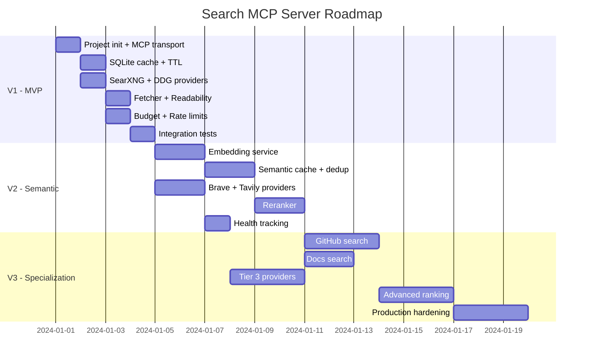

# Roadmap

## V1 — MVP (1–2 дня)

Минимально работающая версия с одним провайдером и базовым кэшем.

### Задачи

- [ ] Инициализация проекта (TypeScript, `@modelcontextprotocol/sdk`)
- [ ] MCP transport (stdio, JSON-RPC)
- [ ] Tool: `search` с валидацией (zod)
- [ ] Tool: `status` с базовой диагностикой
- [ ] Query Normalizer (lowercase, trim, cache key)
- [ ] SQLite cache (queries, results, pages)
- [ ] TTL-based eviction
- [ ] Provider: SearXNG adapter
- [ ] Provider: DuckDuckGo Lite adapter (HTML scraping)
- [ ] Sequential fallback (SearXNG → DDG)
- [ ] Content Fetcher (HTTP GET → readability → markdown)
- [ ] Budget Manager (search limit, fetch limit)
- [ ] Rate limiting (per-provider)
- [ ] Structured logging
- [ ] `.env` конфигурация
- [ ] Тесты: unit для каждого модуля
- [ ] Тесты: интеграционный smoke test

### Результат V1

Агент вызывает `search()` → SearXNG или DDG отвечает → результаты кэшируются → при `include_content=true` страницы загружаются и очищаются.

---

## V2 — Semantic Layer + Tier 2 (3–5 дней)

Добавление семантического кэша и официальных API провайдеров.

### Задачи

- [ ] Embedding сервис (multilingual-e5-small или bge-m3)
- [ ] sqlite-vec интеграция
- [ ] Semantic query cache (find similar, threshold 0.92)
- [ ] Query deduplication (buffer последних 50 запросов)
- [ ] Provider: Brave Search API adapter
- [ ] Provider: Tavily API adapter
- [ ] Reranker: semantic similarity scoring
- [ ] Reranker: domain quality scoring
- [ ] Reranker: freshness scoring
- [ ] Reranker: position blending
- [ ] Weighted final score
- [ ] Intent-aware веса реранкинга
- [ ] Дедупликация результатов по URL
- [ ] Provider health tracking
- [ ] Provider health recovery (5-min retry)
- [ ] Расширенный status() (provider health, cache stats)
- [ ] Тесты: semantic cache
- [ ] Тесты: reranker scoring

### Результат V2

Агент получает дедуплицированные, ранжированные результаты. Похожие запросы не тратят бюджет. 4 провайдера с fallback.

---

## V3 — Специализация + Production (1–2 недели)

Специализированные поисковые режимы и production-ready hardening.

### Задачи

- [ ] GitHub-specific search (GitHub API, issue/PR/code search)
- [ ] Docs-specific search (приоритет readthedocs, docs.*, MDN)
- [ ] Intent routing: автоматическое определение intent по запросу
- [ ] Advanced ranking: learning-to-rank на основе agent feedback
- [ ] Provider health scoring (composite score: latency + error rate + quality)

- [ ] Provider: Exa adapter
- [ ] Provider: Firecrawl adapter
- [ ] Parallel multi-provider queries
- [ ] Result aggregation из нескольких провайдеров
- [ ] robots.txt respect (опционально)
- [ ] Cache analytics (hit rate, popular queries)
- [ ] DB migration system
- [ ] Graceful shutdown (finish in-flight, close DB)
- [ ] Optional vector index (для больших объёмов cached queries)
- [ ] Comprehensive test suite
- [ ] Performance benchmarks
- [ ] Docker image
- [ ] Documentation: deployment guide

### Результат V3

Production-ready MCP Search Server с 7 провайдерами, специализированными режимами поиска, health monitoring и аналитикой.

---

## Зависимости по этапам

## Технический стек

| Категория | Технология | Версия |
|-----------|-----------|--------|
| Runtime | Node.js | >= 20 |
| Language | TypeScript | >= 5.3 |
| MCP SDK | `@modelcontextprotocol/sdk` | latest |
| Database | better-sqlite3 | latest |
| Vector | sqlite-vec | latest |
| Validation | zod | latest |
| HTML parsing | @mozilla/readability | latest |
| DOM | linkedom | latest |
| Markdown | turndown | latest |
| Embeddings | @xenova/transformers | latest |
| HTTP | undici (built-in fetch) | built-in |
| Config | dotenv | latest |
| Logging | pino | latest |
| Testing | vitest | latest |
